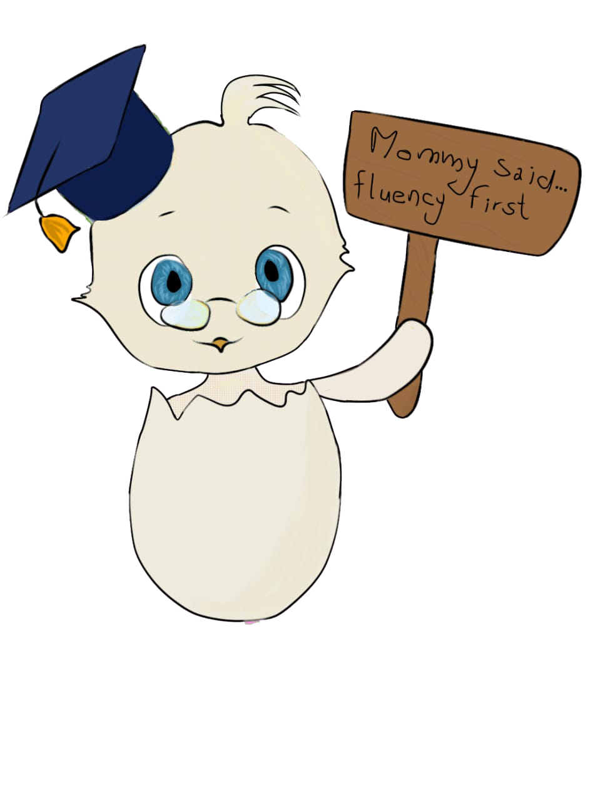
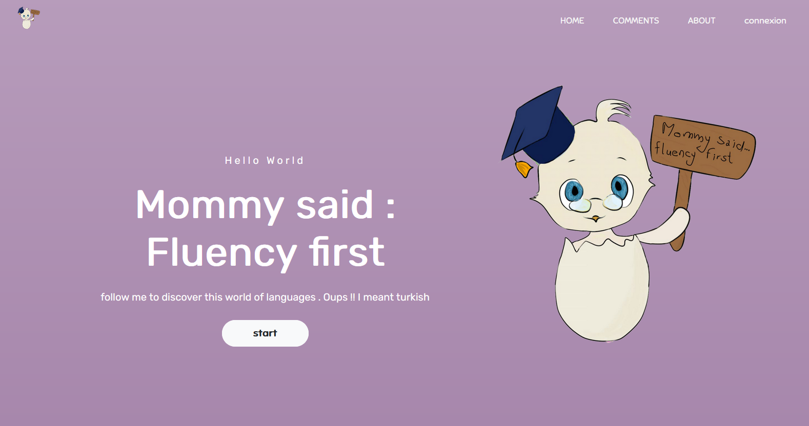
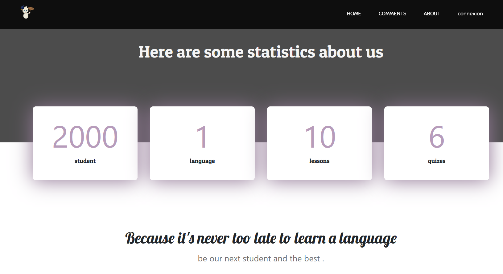
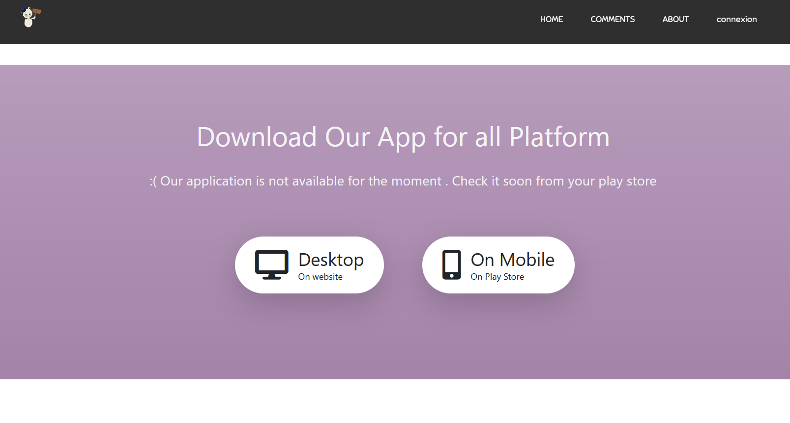
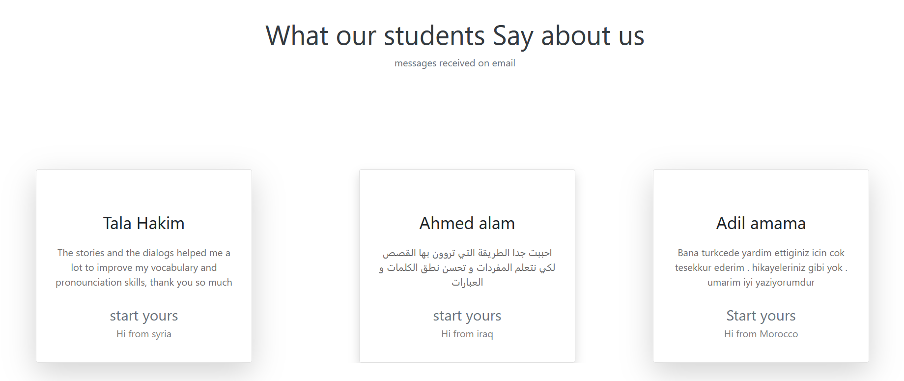

# bulbulitproject

## About the project
Une application web pour apprendre les langues d’une manière amusante et créative .
 L’application est divisée en trois parties essentielles :
 •	La page d’accueil 
 •	La page de connexion 
 •	Les pages des leçons 
## Home page

2/

3/

4/

## languages and technologies used

 •	HTML 
 •	CSS 
 •	JAVASCRIPT
 •	Bootstrap 
 •	Adobe illustrator 
 • ibispaint 

